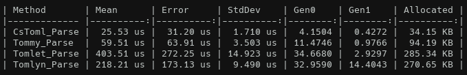
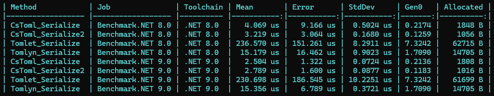
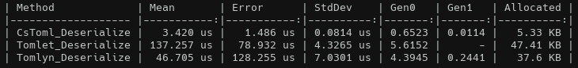

[CsToml - TOML Parser/Serializer  for .NET](https://prozolic.github.io/CsToml)
===

[](LICENSE)
[](https://www.nuget.org/packages/CsToml)
[](https://www.nuget.org/packages/CsToml.Extensions)
[](https://www.nuget.org/packages/CsToml.Extensions.Configuration)
[](https://www.nuget.org/packages/CsToml.Generator/)

CsToml is Fast and low memory allocation TOML Parser/Serializer for .NET.  
For more information about TOML, visit the official website at [https://toml.io/en/](https://toml.io/en/)



> This benchmark parses a string (string) into a TOML object. I used [Tommy](https://github.com/dezhidki/Tommy), [Tomlet](https://github.com/SamboyCoding/Tomlet) and [Tomlyn](https://github.com/xoofx/Tomlyn) for comparison. `CsToml(v1.6.0)` includes additional `UTF8.GetBytes` calls. This benchmark code is [sandbox/Benchmark](https://github.com/prozolic/CsToml/blob/main/sandbox/Benchmark/Benchmark/ParseBenchmark.cs).




> This benchmark convert custom class to string and string to custom class. I used [Tomlet](https://github.com/SamboyCoding/Tomlet) and [Tomlyn](https://github.com/xoofx/Tomlyn) for comparison. `CsToml(v1.6.0)` includes additional `UTF8.GetBytes` calls. This benchmark code is [sandbox/Benchmark Deserialization](https://github.com/prozolic/CsToml/blob/main/sandbox/Benchmark/Benchmark/ClassDeserializationBenchmark.cs), [sandbox/Benchmark Serialization](https://github.com/prozolic/CsToml/blob/main/sandbox/Benchmark/Benchmark/ClassSerializationBenchmark.cs).

CsToml has the following features.

- It complies with [TOML v1.0.0](https://toml.io/en/v1.0.0).
- .NET 8 or later supported.
- Parsing is performed using byte sequence instead of `string`.
- It is processed byte sequence directly by the API defined in `System.Buffers`(`IBufferWriter<byte>`,`ReadOnlySequence<byte>`), memory allocation is small and fast.
- Buffers are rented from the pool(`ArrayPool<T>`), reducing the allocation.
- Core APIs compatible with Native AOT.
- CsToml deserializer has been tested using [the standard TOML v1.0.0 test cases](https://github.com/toml-lang/toml-test/tree/master/tests) and all have passed.
- The serialization interface and implementation is influenced by [MemoryPack](https://github.com/Cysharp/MemoryPack) and [VYaml](https://github.com/hadashiA/VYaml).

Table of Contents
---

* [Installation](#installation)
* [Serialize and deserialize TOML sequence (Parse TOML sequence)](#serialize-and-deserialize-toml-sequence-parse-toml-sequence)
* [Serialize and deserialize custom class/struct/record/record struct (CsToml.Generator)](#serialize-and-deserialize-custom-classstructrecordrecord-struct-cstomlgenerator)
* [Built-in support type](#built-in-support-type)
* [Customize Formatter](#customize-formatter)
* [Deserialize API](#deserialize-api)
* [Serialize API](#serialize-api)
* [Other Deserialize/Serialize APIs](#other-deserializeserialize-apis)
* [TomlDocument class](#tomldocument-class)
* [Pre-release version features overview](#pre-release-version-features-overview)
* [Extensions (CsToml.Extensions)](#extensions-cstomlextensions)
* [Microsoft.Extensions.Configuration extensions (CsToml.Extensions.Configuration)](#microsoftextensionsconfiguration-extensions-cstomlextensionsconfiguration)
* [UnitTest](#unittest)
* [License](#license)

Installation
---

> [!NOTE]
> The official release version is v1.1.0 or higher. Less than v1.1.0 is deprecated.

This library is distributed via NuGet. We target .NET 8 and .NET 9.  

> PM> Install-Package [CsToml](https://www.nuget.org/packages/CsToml/)

When you install `CsToml.Generator`, it automatically creates code to make your custom classes serializable. learn more in our [Serialize and deserialize custom class/struct/record/record struct (CsToml.Generator)](#serialize-and-deserialize-custom-classstructrecordrecord-struct-cstomlgenerator). It is basically recommended to install it together with CsToml.  
However, this requires Roslyn 4.3.1 (Visual Studio 2022 version 17.3) or higher.

> PM> Install-Package [CsToml.Generator](https://www.nuget.org/packages/CsToml.Generator/)  

If `CsToml.Extensions` is installed, you can serialize/deserialize from the TOML file path. learn more in our [Extensions (CsToml.Extensions)](#extensions-cstomlextensions)

> PM> Install-Package [CsToml.Extensions](https://www.nuget.org/packages/CsToml.Extensions/)  

If `CsToml.Extensions.Configuration` is installed, the TOML configuration provider is available. learn more in our [Microsoft.Extensions.Configuration extensions (CsToml.Extensions.Configuration)](#microsoftextensionsconfiguration-extensions-cstomlextensionsconfiguration)

> PM> Install-Package [CsToml.Extensions.Configuration](https://www.nuget.org/packages/CsToml.Extensions.Configuration/)  

Serialize and deserialize TOML sequence (Parse TOML sequence)
---

`CsTomlSerializer.Deserialize<T>` method supports `ReadOnlySpan<byte>`, `ReadOnlySequence<byte>` and `Stream`.
`CsTomlSerializer.Serialize<T>` method supports a return type of `ByteMemoryResult` as well as it can serialize to `IBufferWriter<byte>` or `Stream`.

```csharp
var tomlText = @"
key = ""value""
number = 123
"u8;

var document = CsTomlSerializer.Deserialize<TomlDocument>(tomlText);
string key = document.RootNode["key"u8].GetString();
long number = document.RootNode["number"u8].GetInt64();

using var result = CsTomlSerializer.Serialize(document);
var utf8Span = result.ByteSpan;
var utf8Memory = result.ByteMemory;
```

You can deserialize/serialize it by using `TomlDocument` class, while still preserving the TOML data structure.  

```csharp
var document = CsTomlSerializer.Deserialize<TomlDocument>(tomlText);
using var result = CsTomlSerializer.Serialize(document);
```

Serialize and deserialize custom `class`/`struct`/`record`/`record struct` (`CsToml.Generator`)
---

Define the `class`, `struct`, `record` and `record struct` to be serialized and assign the `[TomlSerializedObject]` Attribute and the partial keyword.  

```csharp
[TomlSerializedObject]
public partial class CsTomlClass
{
    [TomlValueOnSerialized]
    public string Key { get; set; }

    [TomlValueOnSerialized]
    public int? Number { get; set; }

    [TomlValueOnSerialized]
    public int[] Array { get; set; }

    [TomlValueOnSerialized(aliasName: "alias")]
    public string Value { get; set; }

    [TomlValueOnSerialized]
    public TableClass Table { get; set; } = new TableClass();
}

[TomlSerializedObject]
public partial class TableClass
{
    [TomlValueOnSerialized]
    public string Key { get; set; }

    [TomlValueOnSerialized]
    public int Number { get; set; }
}
```

Adding the above attributes will generate code for serialization/deserialization by [Source Generators](https://learn.microsoft.com/en-us/dotnet/csharp/roslyn-sdk/source-generators-overview).  
See [Built-in support type](#built-in-support-type) for more information on available property types.

<details><summary>Generated Code(CsTomlClass_generated.g.cs)</summary>

```csharp
// <auto-generated> This .cs file is generated by CsToml.Generator. </auto-generated>
#nullable enable
#pragma warning disable CS0219 // The variable 'variable' is assigned but its value is never used
#pragma warning disable CS8600 // Converting null literal or possible null value to non-nullable type.
#pragma warning disable CS8601 // Possible null reference assignment.
#pragma warning disable CS8602 // Dereference of a possibly null reference.
#pragma warning disable CS8603 // Possible null reference return.
#pragma warning disable CS8604 // Possible null reference argument for parameter.
#pragma warning disable CS8619 // Possible null reference assignment fix

using CsToml;
using CsToml.Formatter;
using CsToml.Formatter.Resolver;

namespace ConsoleApp;

partial class CsTomlClass : ITomlSerializedObject<CsTomlClass>
{

    static CsTomlClass ITomlSerializedObject<CsTomlClass>.Deserialize(ref TomlDocumentNode rootNode, CsTomlSerializerOptions options)
    {
        var __Key__RootNode = rootNode["Key"u8];
        var __Key__ = options.Resolver.GetFormatter<string>()!.Deserialize(ref __Key__RootNode, options);
        var __Value__RootNode = rootNode["alias"u8];
        var __Value__ = options.Resolver.GetFormatter<string>()!.Deserialize(ref __Value__RootNode, options);
        var __Array__RootNode = rootNode["Array"u8];
        var __Array__ = options.Resolver.GetFormatter<int[]>()!.Deserialize(ref __Array__RootNode, options);
        var __Number__RootNode = rootNode["Number"u8];
        var __Number__ = options.Resolver.GetFormatter<int?>()!.Deserialize(ref __Number__RootNode, options);
        var __Table__RootNode = rootNode["Table"u8];
        var __Table__ = options.Resolver.GetFormatter<global::ConsoleApp.TableClass>()!.Deserialize(ref __Table__RootNode, options);

        var target = new CsTomlClass(){
            Key = __Key__,
            Value = __Value__,
            Array = __Array__,
            Number = __Number__,
            Table = __Table__,
        };

        return target;
    }

    static void ITomlSerializedObject<CsTomlClass>.Serialize<TBufferWriter>(ref Utf8TomlDocumentWriter<TBufferWriter> writer, CsTomlClass target, CsTomlSerializerOptions options)
    {
        writer.BeginScope();
        writer.WriteKey("Key"u8);
        writer.WriteEqual();
        options.Resolver.GetFormatter<string>()!.Serialize(ref writer, target.Key, options);
        writer.EndKeyValue();
        writer.WriteKey("alias"u8);
        writer.WriteEqual();
        options.Resolver.GetFormatter<string>()!.Serialize(ref writer, target.Value, options);
        writer.EndKeyValue();
        writer.WriteKey("Array"u8);
        writer.WriteEqual();
        options.Resolver.GetFormatter<int[]>()!.Serialize(ref writer, target.Array, options);
        writer.EndKeyValue();
        writer.WriteKey("Number"u8);
        writer.WriteEqual();
        options.Resolver.GetFormatter<int?>()!.Serialize(ref writer, target.Number, options);
        writer.EndKeyValue();
        if (options.SerializeOptions.TableStyle == TomlTableStyle.Header && (writer.State == TomlValueState.Default || writer.State == TomlValueState.Table)){
            writer.WriteTableHeader("Table"u8);
            writer.WriteNewLine();
            writer.BeginCurrentState(TomlValueState.Table);
            writer.PushKey("Table"u8);
            options.Resolver.GetFormatter<global::ConsoleApp.TableClass>()!.Serialize(ref writer, target.Table, options);
            writer.PopKey();
            writer.EndCurrentState();
        }
        else
        {
            writer.PushKey("Table"u8);
            options.Resolver.GetFormatter<global::ConsoleApp.TableClass>()!.Serialize(ref writer, target.Table, options);
            writer.PopKey();
        }
        writer.EndScope();
    }

    static void ITomlSerializedObjectRegister.Register()
    {
        if (!TomlValueFormatterResolver.IsRegistered<CsTomlClass>())
        {
            TomlValueFormatterResolver.Register(new TomlSerializedObjectFormatter<CsTomlClass>());
        }

        // Register Formatter in advance.
        if (!TomlValueFormatterResolver.IsRegistered<int?>())
        {
            TomlValueFormatterResolver.Register(new NullableFormatter<int>());
        }
        if (!TomlValueFormatterResolver.IsRegistered<global::ConsoleApp.TableClass>())
        {
            TomlValueFormatterResolver.Register<global::ConsoleApp.TableClass>();
        }

    }
}
```

</details>

<details><summary>Generated Code(TableClass_generated.g.cs)</summary>

```csharp
// <auto-generated> This .cs file is generated by CsToml.Generator. </auto-generated>
#nullable enable
#pragma warning disable CS0219 // The variable 'variable' is assigned but its value is never used
#pragma warning disable CS8600 // Converting null literal or possible null value to non-nullable type.
#pragma warning disable CS8601 // Possible null reference assignment.
#pragma warning disable CS8602 // Dereference of a possibly null reference.
#pragma warning disable CS8603 // Possible null reference return.
#pragma warning disable CS8604 // Possible null reference argument for parameter.
#pragma warning disable CS8619 // Possible null reference assignment fix

using CsToml;
using CsToml.Formatter;
using CsToml.Formatter.Resolver;

namespace ConsoleApp;

partial class TableClass : ITomlSerializedObject<TableClass>
{

    static TableClass ITomlSerializedObject<TableClass>.Deserialize(ref TomlDocumentNode rootNode, CsTomlSerializerOptions options)
    {
        var __Key__RootNode = rootNode["Key"u8];
        var __Key__ = options.Resolver.GetFormatter<string>()!.Deserialize(ref __Key__RootNode, options);
        var __Number__RootNode = rootNode["Number"u8];
        var __Number__ = options.Resolver.GetFormatter<int>()!.Deserialize(ref __Number__RootNode, options);

        var target = new TableClass(){
            Key = __Key__,
            Number = __Number__,
        };

        return target;
    }

    static void ITomlSerializedObject<TableClass>.Serialize<TBufferWriter>(ref Utf8TomlDocumentWriter<TBufferWriter> writer, TableClass target, CsTomlSerializerOptions options)
    {
        writer.BeginScope();
        writer.WriteKey("Key"u8);
        writer.WriteEqual();
        options.Resolver.GetFormatter<string>()!.Serialize(ref writer, target.Key, options);
        writer.EndKeyValue();
        writer.WriteKey("Number"u8);
        writer.WriteEqual();
        options.Resolver.GetFormatter<int>()!.Serialize(ref writer, target.Number, options);
        writer.EndKeyValue(true);
        writer.EndScope();
    }

    static void ITomlSerializedObjectRegister.Register()
    {
        if (!TomlValueFormatterResolver.IsRegistered<TableClass>())
        {
            TomlValueFormatterResolver.Register(new TomlSerializedObjectFormatter<TableClass>());
        }

        // Register Formatter in advance.

    }
}
```

</details>

As a result, it can be serialized and deserialized as follows.
Custom type serialization does not preserve the layout of the original TOML text.

```csharp
var tomlText = @"
Key = ""value""
Number = 123
Array = [1, 2, 3]
alias = ""alias""

[Table]
Key = ""value""
Number = 123
"u8;

var value = CsTomlSerializer.Deserialize<CsTomlClass>(tomlText);
using var serializedText = CsTomlSerializer.Serialize(value);

// Key = "value"
// alias = "alias"
// Array = [ 1, 2, 3 ]
// Number = 123
// Table.Key = "value"
// Table.Number = 123
var serializedTomlText = Encoding.UTF8.GetString(serializedText.ByteSpan);
```

### Properties

`[TomlValueOnSerialized]`serializes public instance properties.
Property names with `[TomlValueOnSerialized]` are used as keys in the TOML document.

```csharp
[TomlSerializedObject]
public partial class CsTomlClass
{
    [TomlValueOnSerialized]
    public string Key { get; set; }
}
```

This is serialized as follows:

```csharp
Key = "value"
```

The key name can also be changed with `[TomlValueOnSerialized(aliasName)]`.  

```csharp
[TomlSerializedObject]
public partial class CsTomlClass
{
    [TomlValueOnSerialized(aliasName: "alias")]
    public string Key { get; set; }
}
```

This is serialized as follows:

```csharp
alias = "value"
```

In `CsToml.Generator` v1.3.0 and later versions, read-only properties, or those that have no setter either private or public, can also be deserialized.

```csharp
[TomlSerializedObject]
internal partial class TypeTable(long intValue, string strValue)
{
    [TomlValueOnSerialized]
    public long IntValue { get; } = intValue;

    [TomlValueOnSerialized]
    public string StrValue { get; private set; } = strValue;
}
```

### Constructors

`CsToml.Generator` supports both parameterized and non-parameterized constructors. The choice of constructor is subject to the following rules.

* Non-public constructors are ignored.
* If there is no explicit constructor, use parameterless.
* If there is one parameterless/parameterized constructor, use it.
* If there is more than one constructor, the parameterized constructor with the most matching parameters is automatically selected.
* The condition for a parameterized constructor is that all parameter names must match the corresponding member names (case-insensitive).

```csharp
[TomlSerializedObject]
internal partial class Constructor(string str) // Parameterized constructors are available.
{
    [TomlValueOnSerialized]
    public string Str { get; set; } = str;
}

[TomlSerializedObject]
internal partial class Constructor2
{
    public Constructor2(string str, long intValue)
    {
        Str = str;
        IntValue = intValue;
    }

    // Use this parameterized constructor.
    public Constructor2(bool booleanValue, string str, double floatValue, long intValue)
    {
        Str = str;
        IntValue = intValue;
        FloatValue = floatValue;
        BooleanValue = booleanValue;
    }

    [TomlValueOnSerialized]
    public string Str { get; set; }

    [TomlValueOnSerialized]
    public long IntValue { get; set; }

    [TomlValueOnSerialized]
    public double FloatValue { get; set; }

    [TomlValueOnSerialized]
    public bool BooleanValue { get; set; }
}

[TomlSerializedObject]
internal partial class Constructor3
{
    // Use this parameterized constructor.
    public Constructor3(string str, long intValue)
    {
        Str = str;
        IntValue = intValue;
    }

    [TomlValueOnSerialized]
    public string Str { get; }

    [TomlValueOnSerialized]
    public long IntValue { get;}
}
```


### CsTomlSerializerOptions

If there is no specification, the default is `CsTomlSerializerOptions.Default`.
You can create custom `CsTomlSerializerOptions` using `CsTomlSerializerOptions.Default` and a with expression.

```csharp
// You can create custom options by using a with expression.
var option = CsTomlSerializerOptions.Default with
{
    SerializeOptions = new SerializeOptions { TableStyle = TomlTableStyle.Header }
};
```

#### SerializeOptions.TableStyle

`SerializeOptions.TableStyle` configure whether a custom type with the `[TomlSerializedObject]` attribute or Dictionary class and interface is serialized as TOML table format or TOML inline table format.
This can be configured by passing `TomlTableStyle.Header` for TOML table format, `TomlTableStyle.Default` or `TomlTableStyle.DottedKey` for TOML inline table format.
The default value is `TomlTableStyle.Default`.

For example:

```csharp
// You can create custom options by using a with expression.
var option = CsTomlSerializerOptions.Default with
{
    SerializeOptions = new SerializeOptions { TableStyle = TomlTableStyle.Header }
};

var value = new CsTomlClass() { 
    Key = "value", Number = 123, Array = [1,2,3] , Value = "alias",
    Table = new TableClass() { Key = "kEY", Number = 123 } 
};

using var serializedText = CsTomlSerializer.Serialize<CsTomlClass>(value, option);
```

In the case of TomlTableStyle.Default, serialize as follows.

```toml
Key = "value"
alias = "alias"
Array = [ 1, 2, 3 ]
Number = 123
Table.Key = "kEY"
Table.Number = 123
```

In the case of TomlTableStyle.Header, serialize as follows.

```toml
Key = "value"
alias = "alias"
Array = [ 1, 2, 3 ]
Number = 123
[Table]
Key = "kEY"
Number = 123
```

#### Spec

`Spec` can enable features in Pre-release version features.
For more information, please click [Pre-release version features overview](#pre-release-version-features-overview).

Built-in support type
---

These types can be serialized/deserialized by default as properties of custom `class`/`struct`/`record`/`record struct`.

* .NET Built-in types(`bool`, `long`, `double`, `string` etc)
* `DateTime`, `DateTimeOffset`, `DateOnly`, `TimeOnly`, `TimeSpan`
* `Enum`, `Half`, `Int128`, `UInt128`, `BigInteger`, `BitArray`
* `Uri`, `Version`, `Guid`, `Type`, `Nullable`, `StringBuilder`
* `T[]`, `Memory<>`, `ReadOnlyMemory<>`
* `List<>`, `Stack<>`, `HashSet<>`, `SortedSet<>`, `Queue<>`, `PriorityQueue<,>`, `LinkedList<>`, `ReadOnlyCollection<>`, `BlockingCollection<>`, `SortedList<>`
* `ConcurrentQueue<>`, `ConcurrentStack<>`, `ConcurrentBag<>`, `ConcurrentDictionary<>`
* `IEnumerable<>`, `ICollection<>`, `IReadOnlyCollection<>`, `IList<>`, `IReadOnlyList<>`, `ISet<>`, `IReadOnlySet<>`
* `Dictionary<>`, `ReadOnlyDictionary<>`, `SortedDictionary<>`, `IDictionary<>`, `IReadOnlyDictionary<>`
* `ArrayList`
* `KeyValuePair<>`, `Tuple<,...>`, `ValueTuple<,...>`
* `OrderedDictionary<>`, `ReadOnlySet<>`
* `ImmutableArray<>`, `ImmutableList<>`, `ImmutableStack<>`, `ImmutableQueue<>`, `ImmutableHashSet<>`, `ImmutableSortedSet<>`, `ImmutableDictionary<>`, `ImmutableSortedDictionary<>`
* `IImmutableList<>`, `IImmutableStack<>`, `IImmutableQueue<>`, `IImmutableSet<>`, `IImmutableDictionary<>`

Customize Formatter
---

`ITomlValueFormatter<T>` is an interface that customizes the serialization behavior of a particular type.
If implements `ITomlValueFormatter<T>`, you can configure to use custom type to `[TomlSerializedObject]` properties.  

For example, `Custom` structure can implement a custom formatter as follows.

```csharp
public struct Custom
{
    public long Value { get; }

    public Custom(long value)
    {
        Value = value;
    }

    public Custom(string str)
    {
        if (long.TryParse(str.AsSpan(), out var value))
        {
            Value = value;
        }
        else
        {
            Value = 0;
        }
    }
}
```

```csharp
public class CustomFormatter : ITomlValueFormatter<Custom>
{
    public Custom Deserialize(ref TomlDocumentNode rootNode, CsTomlSerializerOptions options)
    {
        if (!rootNode.HasValue)
        {
            return default!;
        }
        
        // TOML Integer
        if (rootNode.ValueType == TomlValueType.Integer)
        {
            return new Custom(rootNode.GetInt64());
        }

        // TOML String
        if (rootNode.ValueType == TomlValueType.String)
        {
            return new Custom(rootNode.GetString());
        }

        return default;
    }

    public void Serialize<TBufferWriter>(ref Utf8TomlDocumentWriter<TBufferWriter> writer, Custom target, CsTomlSerializerOptions options)
        where TBufferWriter : IBufferWriter<byte>
    {
        writer.WriteInt64(target.Value);
    }
}
```

It is possible to specify the property type of `[TomlValueOnSerialized]`.

```csharp
[TomlSerializedObject]
public partial class Sample
{
    [TomlValueOnSerialized]
    public Custom Key { get; set; }
}
```

You need to register your custom formatter with TomlValueFormatterResolver.Register.

```csharp
TomlValueFormatterResolver.Register(new CustomFormatter()); // Custom type formatter registration.

var sample = CsTomlSerializer.Deserialize<Sample>(@"Key = 12345"u8);
```

Deserialize API
---

Deserialize has `ReadOnlySpan<byte>`, `ReadOnlySequence<byte>` and `Stream`.
The second argument is `CsTomlSerializerOptions`, which need not be specified explicitly in `CsTomlSerializer.Deserialize`.
It may be used to add optional features in the future.  

```csharp
T Deserialize<T>(ReadOnlySpan<byte> tomlText, CsTomlSerializerOptions? options = null)
T Deserialize<T>(ReadOnlySequence<byte> tomlSequence, CsTomlSerializerOptions? options = null)
T Deserialize<T>(Stream stream, CsTomlSerializerOptions? options = null)
DeserializeAsync<T>(Stream stream, CsTomlSerializerOptions? options = null, bool configureAwait = false, CancellationToken cancellationToken = default)
```

Asynchronous API is available `CsTomlSerializer.DeserializeAsync`.
this only supports `Stream`.

```csharp
var ms = new MemoryStream(tomlText); // FileStream is also OK.
var document = await CsTomlSerializer.DeserializeAsync<TomlDocument>(ms);
```

You can deserialize it by using `TomlDocument` class, while still preserving the TOML data structure.  

```csharp
var document = CsTomlSerializer.Deserialize<TomlDocument>(tomlText);
```

You can also deserialize into primitive object type or collection of keys and values, in addition to custom classes with the `[TomlSerializedObject]` Attribute.

```csharp
// dynamic is the same as IDictionary<object, object>
var dict = CsTomlSerializer.Deserialize<dynamic>(tomlText);
var dict2 = CsTomlSerializer.Deserialize<IDictionary<object, object>>(tomlText);
```

If a syntax error is found during deserialization, an `CsTomlSerializeException` is thrown after deserialization.
The contents of the thrown exception can be viewed at `CsTomlException.ParseExceptions`.

```csharp
var tomlText = @"
key = ""value""
number = ""Error
"u8;

try
{
    // throw CsTomlSerializeException
    var error = CsTomlSerializer.Deserialize<TomlDocument>(tomlText);
}
catch (CsTomlSerializeException ctse)
{
    foreach (var cte in ctse.ParseExceptions!)
    {
        // A syntax error (CsTomlException) was thrown during the parsing line 3.
        var e = cte.InnerException;         // CsToml.Error.CsTomlException: Escape characters 13 were included.
        var lineNumber = cte.LineNumber;
    }
}
```

Serialize API
---

`Serialize` has three overloads, including synchronous and asynchronous APIs.

```csharp
ByteMemoryResult Serialize<T>(T target, CsTomlSerializerOptions? options = null)
void Serialize<TBufferWriter, T>(ref TBufferWriter bufferWriter, T target, CsTomlSerializerOptions? options = null)
void Serialize<T>(Stream stream, T value, CsTomlSerializerOptions? options = null)
async ValueTask SerializeAsync<T>(Stream stream, T value, CsTomlSerializerOptions? options = null, bool configureAwait = false, CancellationToken cancellationToken = default)
```

`IBufferWriter<byte>` serializes directly into the buffer.
If `Span<byte>` or `Memory<byte>` is required, API that returns a `ByteMemoryResult` can be used.

```csharp
var bufferWriter = new ArrayBufferWriter<byte>();
CsTomlSerializer.Serialize(ref bufferWriter, document);

// The first is obtained by ByteMemoryResult.
using var result = CsTomlSerializer.Serialize(document);
Console.WriteLine(Encoding.UTF8.GetString(result.ByteSpan));
```

Asynchronous API is available `CsTomlSerializer.SerializeAsync`.
this only supports `Stream`, the same as deserialization.

```csharp
var ms2 = new MemoryStream(65536);
await CsTomlSerializer.SerializeAsync(ms2, document);
Console.WriteLine(Encoding.UTF8.GetString(ms2.ToArray()));
```

Other Deserialize/Serialize APIs
---

`CsTomlSerializer.DeserializeValueType<T>` deserialize TOML values to a specified type.
`CsTomlSerializer.SerializeValueType` serializes the value into TOML format.  
The object can be used with the type listed in [Built-in support type](#built-in-support-type).

```csharp
T DeserializeValueType<T>(ReadOnlySpan<byte> tomlText, CsTomlSerializerOptions? options = null)
T DeserializeValueType<T>(ReadOnlySequence<byte> tomlSequence, CsTomlSerializerOptions? options = null)
ByteMemoryResult SerializeValueType<T>(T target, CsTomlSerializerOptions? options = null)
void SerializeValueType<TBufferWriter, T>(ref TBufferWriter bufferWriter, T target, CsTomlSerializerOptions? options = null)
```

```csharp
var tomlIntValue = CsTomlSerializer.DeserializeValueType<long>("1234"u8);
var tomlStringValue = CsTomlSerializer.DeserializeValueType<string>("\"\\U00000061\\U00000062\\U00000063\""u8); // abc
var tomlDateTimeOffsetValue = CsTomlSerializer.DeserializeValueType<DateTimeOffset>("2024-10-20T15:16:00"u8);
var tomlArrayValue = CsTomlSerializer.DeserializeValueType<string[]>("[ \"red\", \"yellow\", \"green\" ]"u8);
var tomlinlineTableValue = CsTomlSerializer.DeserializeValueType<IDictionary<string, object>>("{ x = 1, y = 2, z = \"3\" }"u8);
var tomlTupleValue = CsTomlSerializer.DeserializeValueType<Tuple<string,string,string>>("[ \"red\", \"yellow\", \"green\" ]"u8);

using var serializedTomlValue1 = CsTomlSerializer.SerializeValueType(tomlIntValue);
// 1234
using var serializedTomlValue2 = CsTomlSerializer.SerializeValueType(tomlStringValue);
// "abc"
using var serializedTomlValue3 = CsTomlSerializer.SerializeValueType(tomlDateTimeValue);
// 2024-10-20T15:16:00
using var serializedTomlValue4 = CsTomlSerializer.SerializeValueType(tomlArrayValue);
// [ "red", "yellow", "green" ]
using var serializedTomlValue5 = CsTomlSerializer.SerializeValueType(tomlinlineTableValue);
// {x = 1, y = 2, z = "3"}
using var serializedTomlValue6 = CsTomlSerializer.SerializeValueType(tomlTupleValue);
// [ "red", "yellow", "green" ]
```

`TomlDocument` class
---

Use `TomlDocument` when parsing with the TOML structure preserved.  
It can get the TOML value by specifying the indexer in the `TomlDocumentNode.RootNode` property.

### Key/Value Pair

For example, in the following Key/Value Pair

```TOML
key = "value"
```

This can retrieve as follows.

```csharp
var document = CsTomlSerializer.Deserialize<TomlDocument>(toml);
// this[ReadOnlySpan<char> key]
TomlDocumentNode keyNode = document.RootNode["key"u8]; // this is best performance.
var value = tableKeyNode.GetString(); // value

// this[ReadOnlySpan<byte> key]
TomlDocumentNode keyNode = document.RootNode["key"];
var value = tableKeyNode.GetString(); // value
```

The best performance is achieved with `ReadOnlySpan<byte>`.
`ReadOnlySpan<char>` is a little slower because the process of conversion from UTF16 to UTF8 is performed.

### TOML String

For example:

```TOML
key = "value"
```

This can retrieve as follows.

```csharp
string str = document.RootNode["key"u8].GetString();    // "value"
```

```csharp
if (document.RootNode["key"u8].TryGetString(out string value))
{
    Console.WriteLine(value);   // "value"
}
```

### TOML Integer

For example:

```TOML
key = 1234
```

This can retrieve value as follows.

```csharp
long value = document.RootNode["key"u8].GetInt64();     // 1234
```

```csharp
if (document.RootNode["key"u8].TryGetInt64(out long value))
{
    Console.WriteLine(value);   // 1234
}
```

It can also retrieve value as another primitive type (`string`, `double`, `bool`, etc...) as follows.

```csharp
string strValue = document.RootNode["key"u8].GetString();       // "1234"
double doubleValue = document.RootNode["key"u8].GetDouble();    // 1234
bool boolValue = document.RootNode["key"u8].GetBool();          // true
```

### TOML Float

For example:

```TOML
key = 3.1415
```

This can retrieve value as follows.

```csharp
double value = document.RootNode["key"u8].GetDouble();  // 3.1415
```

```csharp
if (document.RootNode["key"u8].TryGetDouble(out double value))
{
    Console.WriteLine(value);    // 3.1415
}
```

It can also retrieve value as another primitive type (`string`,`long`, `bool`, etc...) as follows.

```csharp
string strValue = document.RootNode["key"u8].GetString();       // "3.1415"
long longValue = document.RootNode["key"u8].GetInt64();         // 3
bool boolValue = document.RootNode["key"u8].GetBool();          // true
```

### TOML Boolean

For example:

```TOML
key = true
```

This can retrieve value as follows.

```csharp
bool value = document.RootNode["key"u8].GetBool();  // true
```

```csharp
if (document.RootNode["key"u8].TryGetBool(out bool value))
{
    Console.WriteLine(value);   // true
}
```

It can also retrieve value as another primitive type (`string`,`long`, `bool`, etc...) as follows.

```csharp
string strValue = document.RootNode["key"u8].GetString();       // "True" ( bool.TrueString )
long longValue = document.RootNode["key"u8].GetInt64();         // 1
double doubleValue = document.RootNode["key"u8].GetDouble();    // 1
```

### TOML Offset Date-Time

For example:

```TOML
key = 1979-05-27T07:32:00Z
```

This can retrieve value as follows.

```csharp
DateTimeOffset dateTimeOffsetValue = document.RootNode["key"u8].GetDateTimeOffset();
```

```csharp
if (document.RootNode["key"u8].TryGetDateTimeOffset(out DateTimeOffset value))
{
    Console.WriteLine(value);
}
```

It can also retrieve value as another primitive type (`string`,`DateTime`, `DateOnly`,`TimeOnly`, etc...) as follows.

```csharp
string value = document.RootNode["key"u8].GetString();              // "1979-05-27T07:32:00.0000000+00:00"
DateTime dateTimeValue = document.RootNode["key"u8].GetDateTime();
DateOnly dateOnlyValue = document.RootNode["key"u8].GetDateOnly();
TimeOnly timeOnlyValue = document.RootNode["key"u8].GetTimeOnly(); 
```

### TOML Local Date-Time

For example:

```TOML
key = 1979-05-27T07:32:00
```

This can retrieve value as follows.

```csharp
DateTime value = document.RootNode["key"u8].GetDateTime();
```

```csharp
if (document.RootNode["key"u8].TryGetDateTime(out DateTime value))
{
    Console.WriteLine(value);
}
```

It can also retrieve value as another primitive type (`string`,`DateTimeOffset`, `DateOnly`,`TimeOnly`, etc...) as follows.

```csharp
string value = document.RootNode["key"u8].GetString();              // "1979-05-27T07:32:00.0000000"
DateTimeOffset dateTimeOffsetValue = document.RootNode["key"u8].GetDateTimeOffset();
DateOnly dateOnlyValue = document.RootNode["key"u8].GetDateOnly();
TimeOnly timeOnlyValue = document.RootNode["key"u8].GetTimeOnly(); 
```

### TOML Local Date

For example:

```TOML
key = 1979-05-27
```

This can retrieve value as follows.

```csharp
DateOnly value = document.RootNode["key"u8].GetDateOnly();
```

```csharp
if (document.RootNode["key"u8].TryGetDateOnly(out DateOnly value))
{
    Console.WriteLine(value);
}
```

It can also retrieve value as another primitive type (`string`,`DateTime`, `DateOnly`, etc...) as follows.

```csharp
string value = document.RootNode["key"u8].GetString();              // "1979-05-27"
DateTimeOffset dateTimeOffsetValue = document.RootNode["key"u8].GetDateTimeOffset();
DateTime dateTimeValue = document.RootNode["key"u8].GetDateTime();
```

### TOML Local Time

For example:

```TOML
key = 07:32:00
```

This can retrieve value as follows.

```csharp
TimeOnly value = document.RootNode["key"u8].GetTimeOnly(); 
```

```csharp
if (document.RootNode["key"u8].TryGetTimeOnly(out TimeOnly value))
{
    Console.WriteLine(value);
}
```

It can also retrieve value as another primitive type (`string`, etc...) as follows.

```csharp
string value = document.RootNode["key"u8].GetString();              // "07:32:00.0000000"
```

### TOML Array

For example:

```TOML
array = [ 1, 2, 3 ]
```

This can retrieve value as follows.
`TomlValue` is the class that actually has the TOML value, and the value can retrieve value with almost the same API as the `TomlDocumentNode`.

```csharp
ReadOnlyCollection<TomlValue> array = document.RootNode["array"u8].GetArray();
var value0 = array[0].GetInt64(); // 1
var value1 = array[1].GetInt64(); // 2
var value2 = array[2].GetInt64(); // 3

var value00 = document.RootNode["array"u8].GetArrayValue(0).GetInt64(); // 1
```

```csharp
if (document.RootNode["array"u8].TryGetArray(out ReadOnlyCollection<TomlValue> array))
{
    var value0 = array[0].GetInt64(); // 1
    var value1 = array[1].GetInt64(); // 2
    var value2 = array[2].GetInt64(); // 3
}
if (document.RootNode["array"u8].TryGetArrayValue(0, out TomlValue value11))
{
    Console.WriteLine(value11.GetInt64());
}
```

### TOML Table

For example:

```TOML
[table]
key = "tablevalue"
```

the key/values of that table can also be retrieved as follows.

```csharp
var value = document.RootNode["table"u8]["key"u8].GetString(); // tablevalue
```

### TOML Inline Table

For example:

```TOML
key = { int = 123, type.name = ""inline table"" }
```

the key/values of that table can also be retrieved as follows.

```csharp
var intValue = document.RootNode["key"u8]["int"u8].GetInt64();              // 123
var typeName = document.RootNode["key"u8]["type"u8]["name"u8].GetString();  // "inline table"
```

### TOML Array of Tables

For example:

```TOML
[[array.of.tables]]

[[array.of.tables]]
key = "value"
array = [ 1, 2, 3 ]

[[array.of.tables]]
key = "value2"
array = [ 4, 5, 6 ]
```

the key/values of that table can also be retrieved as follows.

```csharp
var key1 = document.RootNode["array"u8]["of"u8]["tables"u8][1]["key"u8].GetString();               
// "value"
var arrayIndex1 = document.RootNode["array"u8]["of"u8]["tables"u8][1]["array"u8][0].GetInt64();    
// 1

var key2 = document.RootNode["array"u8]["of"u8]["tables"u8][2]["key"u8].GetString();               
// "value2"
var arrayIndex2 = document.RootNode["array"u8]["of"u8]["tables"u8][2]["array"u8][0].GetInt64();    
// 4
```

### Complex samples.

```TOML
dotted.keys = ""value""
configurations = [1, {key = [ { key2 = [""VALUE""]}]}]
```

```csharp
var dottedKeys = document!.RootNode["dotted"u8]["keys"u8].GetString(); // "value"
var configurations = document!.RootNode["configurations"u8][1]["key"u8][0]["key2"u8][0].GetString(); // "VALUE"
```

### TomlDocumentNode API

To retrieve primitive values from `TomlDocumentNode` and `TomlValue`, call the following API.
If an API with the `Get` prefix fails, an `CsTomlException` is thrown and a value is returned if it was successful.
If an API with the `TryGet` prefix fails, false is returned and the value is set to the argument of the out parameter if it was successful.

```csharp
public struct TomlDocumentNode
{
    public bool HasValue { get; }
    public TomlValueType ValueType { get; }
    public readonly TomlValue GetTomlValue()
    public bool CanGetValue(TomlValueFeature feature)
    public ReadOnlyCollection<TomlValue> GetArray()
    public TomlValue GetArrayValue(int index)
    public string GetString()
    public long GetInt64()
    public double GetDouble()
    public bool GetBool()
    public DateTime GetDateTime()
    public DateTimeOffset GetDateTimeOffset()
    public DateOnly GetDateOnly()
    public TimeOnly GetTimeOnly()
    public object GetObject()
    public T GetNumber<T>() where T : struct, INumberBase<T>
    public T GetValue<T>()
    public bool TryGetArray(out ReadOnlyCollection<TomlValue> value)
    public bool TryGetArrayValue(int index, out TomlValue value)
    public bool TryGetString(out string value)
    public bool TryGetInt64(out long value)
    public bool TryGetDouble(out double value)
    public bool TryGetBool(out bool value)
    public bool TryGetDateTime(out DateTime value)
    public bool TryGetDateTimeOffset(out DateTimeOffset value)
    public bool TryGetDateOnly(out DateOnly value)
    public bool TryGetTimeOnly(out TimeOnly value)
    public bool TryGetObject(out object value)
    public bool TryGetNumber<T>(out T value) where T : struct, INumberBase<T>
    public bool TryGetValue<T>(out T value)
}
```

### Check the TOML type

`TomlDocumentNode.ValueType` is possible to check the TOML type held.

```csharp
public enum TomlValueType
{
    Key = -1, // This is for internal use only.
    Empty = 0, // Rarely used.
    String = 1,
    Integer = 2,
    Float = 3,
    Boolean = 4,
    OffsetDateTime = 5,
    LocalDateTime = 6,
    LocalDate = 7,
    LocalTime = 8,
    Array = 9,
    Table = 10, // Rarely used.
    InlineTable = 11, // Rarely used.
}
```

### Converted to other convertible values

`TomlDocumentNode.GetValue<T>` and `TomlDocumentNode.TryGetValue<T>` can be used to obtain a value converted from a Toml value type to a specified type.
The type that can be specified for `T` is [Built-in support type](#built-in-support-type).

```TOML
key = ""https://github.com/prozolic/CsToml""
```

```csharp
var uri = document.RootNode["key"u8].GetValue<Uri>(); // https://github.com/prozolic/CsToml
```

### Check which values can be converted

`TomlDocumentNode.CanGetValue` can be used to see which Toml value types can be converted.

```csharp
if (document.RootNode["key"u8].CanGetValue(feature: TomlValueFeature.Int64)) 
{
    var value = document.RootNode["key"u8].GetInt64();
    Console.WriteLine(value);
}
else
{
    var value = document.RootNode["key"u8].GetInt64(); // Throw CsTomlException.
    Console.WriteLine(value);
}
```

```csharp
[Flags]
public enum TomlValueFeature
{
    None = 0,
    String = 1,
    Int64 = 1 << 1,
    Double = 1 << 2,
    Boolean = 1 << 3,
    Number = 1 << 4,
    DateTime = 1 << 5,
    DateTimeOffset = 1 << 6,
    DateOnly = 1 << 7,
    TimeOnly = 1 << 8,
    Object = 1 << 9,
    Array = 1 << 10,
    Table = 1 << 11,
    InlineTable = 1 << 12,
}
```

`ToDictionary` method is available as an API to convert from `TomlDocument` to `IDictionary<TKey, TValue>`.

```csharp
var document = CsTomlSerializer.Deserialize<TomlDocument>(tomlText);

// Same as document.RootNode.GetValue<Dictionary<object, object>>().
var dict = document.ToDictionary<object, object>();
```

Pre-release version features overview
---

You can use the upcoming features planned for TOML v1.1.0, which has not been officially released yet.
Each feature can be enabled individually from CsTomlSerializerOptions.Spec.

> [!WARNING]
> As these are features from an unreleased version, they may be subject to specification changes or deprecation in the future.

```csharp
var v110Options = CsTomlSerializerOptions.Default with
{
    Spec = new ()
    {
        AllowUnicodeInBareKeys = true,
        AllowNewlinesInInlineTables = true,
        AllowTrailingCommaInInlineTables = true,
        AllowSecondsOmissionInTime = true,
        SupportsEscapeSequenceE = true,
        SupportsEscapeSequenceX = true,
    }
};
var document = CsTomlSerializer.Deserialize<TomlDocument>(tomlText, v110Options);
```

### AllowUnicodeInBareKeys

This feature enables the use of Unicode characters (non-ASCII) in unquoted (bare) keys. This allows you to use characters from non-English scripts directly in key names without requiring quotation marks.  
For example:

```toml
€ = 'Euro'
😂 = ""rofl""
a‍b = ""zwj""
ÅÅ = ""U+00C5 U+0041 U+030A""
あイ宇絵ォ = ""Japanese""
```

### AllowNewlinesInInlineTables

This feature permits newline characters after key/value pairs within inline tables.  
For example:

```toml
name = { 
    first = ""CsToml"", 
    last = ""prozolic"" }
```

### AllowTrailingCommaInInlineTables

This feature supports an optional trailing comma after the last key/value pair in inline tables.  
For example:

```toml
name = {  first = ""CsToml"",  last = ""prozolic"", }
```

### AllowSecondsOmissionInTime

This feature makes the seconds component optional in both Date-Time and Time values. Previously, time specifications required hours, minutes, and seconds. With this feature enabled, you can use shortened time formats like `12:30` instead of requiring `12:30:00`.  
For example:

```toml
without-seconds-1 = 13:37
without-seconds-2 = 1979-05-27 07:32Z
without-seconds-3 = 1979-05-27 07:32-07:00
without-seconds-4 = 1979-05-27T07:32
```

### SupportsEscapeSequenceE

This feature supports for the `\e` escape sequence as a shorthand for the escape character (ASCII code 27).  
For example:

```toml
key = "\e There is no escape! \e"
```

### SupportsEscapeSequenceX

This feature supports for hexadecimal escape notation (`\x00`) in basic strings.  
For example:

```toml
name = "this is \x43\x73\x54\x6f\x6d\x6c"
```

Extensions (`CsToml.Extensions`)
---

`CsToml.Extensions` provides APIs to serialize and deserialize Toml files on disk.

```csharp
// deserialize from TOML File
var document = CsTomlFileSerializer.Deserialize<TomlDocument>("test.toml");
var document2 = await CsTomlFileSerializer.DeserializeAsync<TomlDocument>("test.toml");

// serialize To TOML File
CsTomlFileSerializer.Serialize("test.toml", document);
await CsTomlFileSerializer.SerializeAsync("test.toml", document);
```

`CsTomlFileSerializer.Deserialize` and `CsTomlFileSerializer.DeserializeAsync` deserialize UTF8 strings in TOML files into `TomlDocument`.
`CsTomlFileSerializer.Serialize` and `CsTomlFileSerializer.SerializeAsync` serialize the UTF8 string of `TomlDocument` to the TOML file.  

`CsToml.Extensions` uses [Cysharp/NativeMemoryArray](https://github.com/Cysharp/NativeMemoryArray) as a third party library.

Microsoft.Extensions.Configuration extensions (`CsToml.Extensions.Configuration`)
---

`CsToml.Extensions.Configuration` provides a configuration provider for `Microsoft.Extensions.Configuration` that reads TOML files or streams. Basically, the usage and options are the same as for [File configuration provider in .NET](https://learn.microsoft.com/en-us/dotnet/core/extensions/configuration-providers).

```csharp
namespace CsToml.Extensions.Configuration;

// ConfigurationBuilder
var conf = new ConfigurationBuilder().AddTomlFile("test.toml").Build();

// Blazor Web App 
var builder = WebApplication.CreateBuilder(args);
builder.Configuration.AddTomlFile("test.toml");
var app = builder.Build();

using var fs = new FileStream("test.toml", FileMode.Open);
builder.Configuration.AddTomlStream(fs);
```

```csharp
public static IConfigurationBuilder AddTomlFile(this IConfigurationBuilder builder, string path);
public static IConfigurationBuilder AddTomlFile(this IConfigurationBuilder builder, string path, bool optional);
public static IConfigurationBuilder AddTomlFile(this IConfigurationBuilder builder, string path, bool optional, bool reloadOnChange);
public static IConfigurationBuilder AddTomlFile(this IConfigurationBuilder builder, Microsoft.Extensions.FileProviders.IFileProvider? provider, string path, bool optional, bool reloadOnChange);
public static IConfigurationBuilder AddTomlFile(this IConfigurationBuilder builder, Action<TomlFileConfigurationSource> configureSource);
public static IConfigurationBuilder AddTomlStream(this IConfigurationBuilder builder, System.IO.Stream stream);
```

UnitTest
---

Please note that we are using the TOML files located in the ['tests/' directory of the ‘toml-test repository (MIT License)’](https://github.com/toml-lang/toml-test/tree/master/tests) for some of our unit tests.

License
---

MIT License. Some code is implemented based on [dotnet/runtime](https://github.com/dotnet/runtime), Please check the original license.
